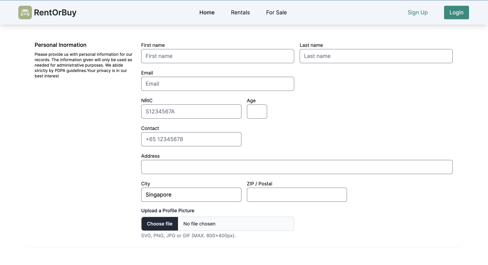
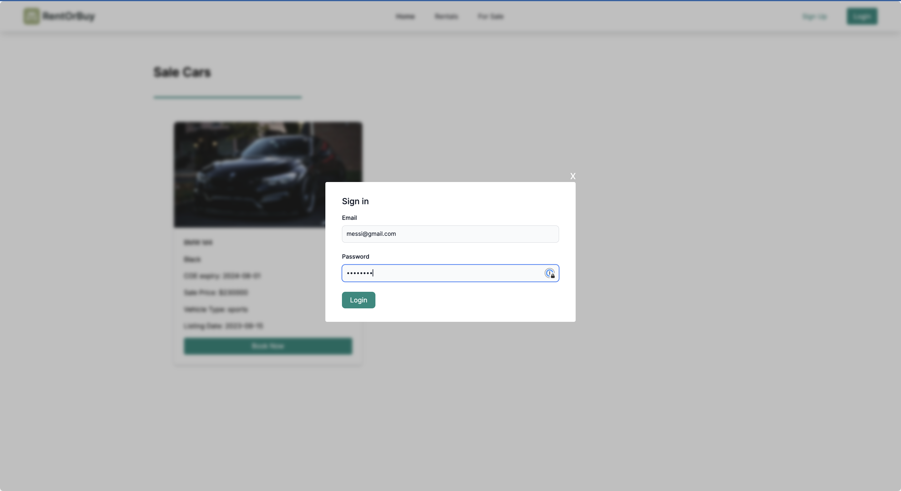
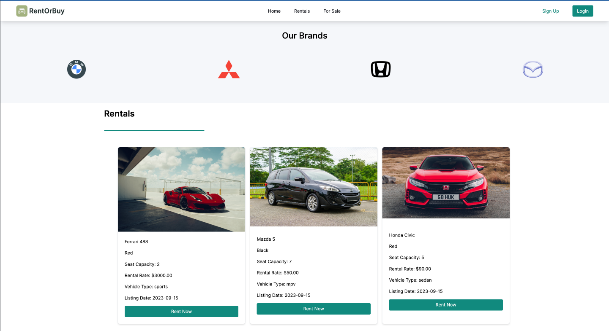
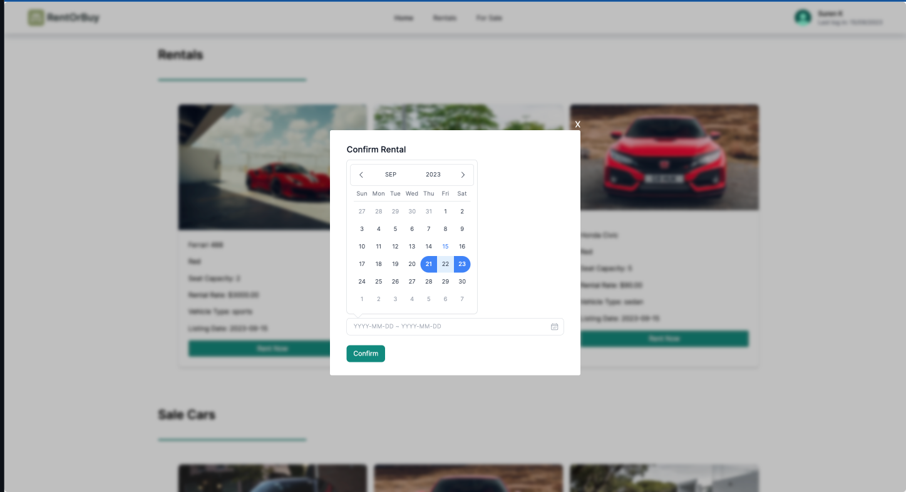

# RentOrBuy.com

Online car dealer rental and sales full stack project.


## Table of Contents:
1. Getting Started
2. API calls
3. Technologies Used
4. Front-End Libraries used
5. Back-End libraries used
6. Key Features
7. Credits 
8. Future Improvements 


## Getting Started 

1. Setup Front-End:
   >Creat a .env file with the following variables
   ```
   VITE_SERVER=http://localhost:8000
   ```
   
  
2. Login Credentials 
   - Create own account in Sign Up page or in Django admin
     
   - Password should be more than 8 charcater and not be related to the user first name or last name

3. Login at the navigation bar 
   >Login Page
   


## API endpoints (11 endpoints consumed)
  - Customer registration | Put
   ```
   /customer/register/
   ```
   - Customer delete account | Delete
    ```
     /customer/delete
    ```
  - Customer info | GET
    ```
    /customer/details
    ```
  - Customer edit info | PATCH
    ```
    /customer/editInfo
    ```
  - Customer rental transaction | GET
    ```
    /customer/cars/rental
    ```
  - Customer rental reciept | POST
    ```
    /customer/rental
    ```
 - Customer sale transaction | GET
   ```
   /customer/cars/sales 
   ```
 - Customer sale receipt | POST
   ```
   /customer/carSale 
   ```
 - JWT Authentication
   ```
   /login/token
   ```
 - Dealer get all cars for sales | GET
   ```
   /dealer/cars/forsale
   ```
- Dealer get all cars for rent | GET
  ```
  /dealer/car/rentals
  ```
   

## Technologies Used:
**Front-End**
- React (javascript)
 <br/><br/>

**Back-End**
- Django (Python v3.11)
- Postgresql 

## Front-End Libraries Used: 
1. React Router Dom 
2. TailwindCSS 
3. flowbite-react
4. react-tailwindcss-datepicker
5. jwt-decode
6. dayjs
7. postcss

## Back-End Libraries Used: 
1. psycopg2-binary
2. djangorestframework
3. djangorestframework-simplejwt
4. django-cors-headers

## Key Features:
- CRUD functionality for customer accounts
- If customer deleted an account and customer creates an account again all the customer previous data retained
- Rental and Sales appointment booking systems

- Rentals cannot overlap for a select car

- Admin portal for dealer to add post to site automatically and update rental status 


## Current Bugs:
